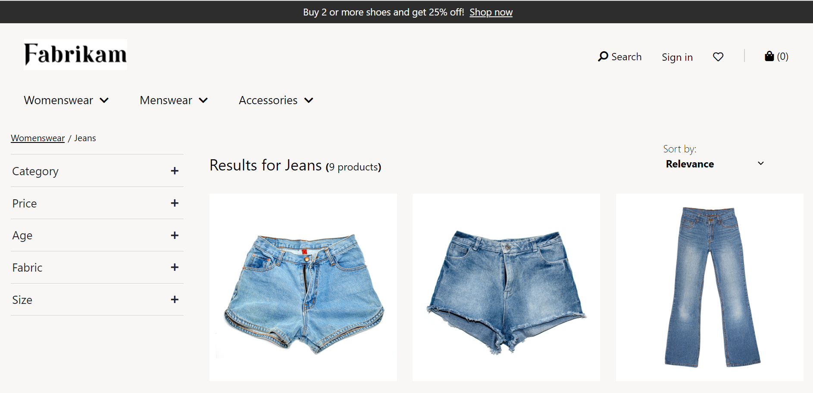
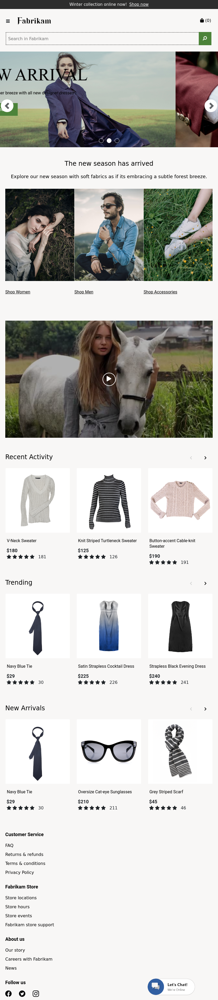

# Azure Cognitive Search UI

This sample is a React template for [Azure Cognitive Search](https://docs.microsoft.com/en-us/azure/search/search-what-is-azure-search). It leverages the [Azure SDK for Javascript/Typescript](https://github.com/Azure/azure-sdk-for-js/tree/master/sdk/search/search-documents/) and [Azure Static Web Apps](https://aka.ms/swadocs) to make it easy to get up and running with a simple web application.

You can view the resulting web application here: [https://thankful-wave-0e341ee1e.azurestaticapps.net//](https://thankful-wave-0e341ee1e.azurestaticapps.net//)



You can easily deploy the sample onto Azure or run it locally by following the steps below.

## Running the application locally

To run the sample locally, follow the steps below.

### Prerequisites
- [Node.js and Git](https://nodejs.org/)
- [Visual Studio Code](https://code.visualstudio.com/?WT.mc_id=shopathome-github-jopapa) installed
- The [Azure Functions extension](https://marketplace.visualstudio.com/items?itemName=ms-azuretools.vscode-azurefunctions&WT.mc_id=shopathome-github-jopapa) installed
- The [Azure Functions Core Tools](https://docs.microsoft.com/azure/azure-functions/functions-run-local?WT.mc_id=shopathome-github-jopapa) installed

### Setup

1. Clone (or Fork and Clone) this repository

1. Rename the `api/local.settings.json.rename` file to `api/local.settings.json`.

The `local.settings.json` file holds all of the keys that the application needs.

For this sample, there is a search index using the [dataset](https://dev.azure.com/retailindustry/fabrikam/_git/fabrikamWeb?path=/src/API/json/product-data-v4.json) that that is publicly available using the connection information below. The index consists of 10,000 popular products that we'll search over in our application.

```json
{
  "IsEncrypted": false,
  "Values": {
    "AzureWebJobsStorage": "",
    "FUNCTIONS_WORKER_RUNTIME": "node",
    "SearchApiKey": "************",
    "SearchServiceName": "retaildemocogsearchsemantic",
    "SearchIndexName": "fabrikam-fashion",
    "SearchFacets": "category1*,Price-,Color,Size,Gender*,AgeGroup,category2*,Material,Style"
  }
}
```

## Run the app locally

This project can be run anywhere, but VS Code is required for local debugging.

1. Open the application with VS Code.

### Running the front-end

1. Install front-end dependencies...

   ```bash
   npm install
   ```

1. Run the front-end project in the browser (automatically opens a browser window).

   ```bash
   npm start
   ```
1. Run build the front-end project .

   ```bash
   npm run build
   ```

### Running the API

1. From VS Code, press <kbd>F5</kbd>


## Deploying this sample

### Prerequisites

- A GitHub azure account 
- An Azure subscription

### Creating the web app

Next, you need to create a Static Web App in the Azure portal. Click the button below to create one:

[](https://portal.azure.com/?feature.customportal=false#create/Microsoft.StaticApp)


### Successfully deployed homepage.


